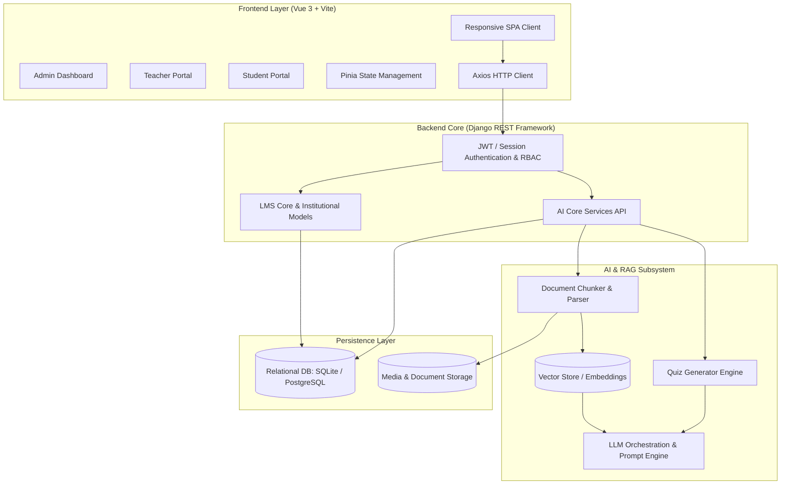

# 🎓 LearnMS — Enterprise AI-Powered Learning Management System

[](https://vuejs.org/)
[](https://www.djangoproject.com/)
[](https://platform.openai.com/)
[](https://www.python.org/)
[](https://getbootstrap.com/)

> **LearnMS** is a next-generation, full-stack Learning Management System designed to revolutionize digital education by integrating **Retrieval-Augmented Generation (RAG) AI Tutoring**, **Automated Question/Quiz Generation**, **Real-Time Grade Analytics**, and **Role-Based Portals** (Admin, Teacher, and Student).

---

## 🌟 Visual Showcase

| 1. AI Context-Aware Tutor | 2. AI Quiz Generator |
| :---: | :---: |
| <br>*(RAG Chatbot with Course Document Ingestion)* | <br>*(Automated Dynamic Assessment Engine)* |

| 3. Teacher Grade & Course Hub | 4. Student Analytics & Dashboard |
| :---: | :---: |
| <br>*(Attendance, Gradebook & Course Provisioning)* | <br>*(Interactive Quizzes, Progress & Real-time Analytics)* |

---

## 🚀 Key Highlights & Architectural Features

### 🧠 1. Intelligent AI Tutoring Engine (RAG Pipeline)
- **Document-Grounded Q&A**: Students can upload lecture slides, PDF documents, or syllabus notes. The backend embeds and queries context via vector search to eliminate hallucinations.
- **Session Continuity**: Multi-session conversational memory with contextual history and document-specific references.
- **Safety & Educational Guardrails**: Custom system prompts keep answers focused strictly on academic subject matter.

### ⚡ 2. Automated AI Quiz & Assessment Studio
- **Topic & Document-to-Quiz Generator**: Teachers can generate customized quizzes (MCQs, True/False, Short answers) by providing course topics or uploading lecture materials.
- **Granular Question Regeneration**: Allows instructors to review generated questions one by one and regenerate specific items instantly with fine-tuned difficulty parameters.
- **1-Click Publishing**: Seamlessly converts generated questions into live student assessments with automated timers and instant grading.

### 👥 3. Comprehensive Role-Based Portals
- **👑 Administrator Portal**:
  - Multi-department and institutional profile provisioning.
  - Role-Based Access Control (RBAC) across SuperAdmin, Admin, Teacher, and Student tiers.
  - System-wide audit logs, usage metrics, and user management.
- **👩‍🏫 Instructor Portal**:
  - Course curriculum management, batch allocation, and resource sharing.
  - Live attendance tracker with exportable CSV/PDF summaries.
  - Comprehensive Gradebook with auto-graded quizzes and manual rubric evaluations.
- **👨‍🎓 Student Portal**:
  - Unified student dashboard tracking upcoming assignments, pending quizzes, and timetable schedules.
  - Interactive quiz attempt interface with real-time countdown timers and immediate score breakdowns.
  - Centralized digital library for lecture notes, slides, and learning resources.

---

## 🏗️ System Architecture



---

## 🛠️ Technology Stack

| Domain | Technology / Library | Usage & Purpose |
| :--- | :--- | :--- |
| **Frontend Framework** | **Vue.js 3** (Composition & Options API) | High-performance reactive Single Page Application (SPA) |
| **Build Tooling** | **Vite 7** | Ultra-fast HMR and optimized production bundling |
| **State Management** | **Pinia** | Centralized reactive state for authentication, user profiles & quiz states |
| **Styling & Icons** | **Bootstrap 5 + SCSS + Bootstrap Icons** | Sleek, modern, and fully responsive UI |
| **Data Visualization** | **Chart.js** | Visual performance analytics and grade distribution graphs |
| **Document Export** | **jsPDF & jsPDF-AutoTable** | Dynamic client-side generation of report cards and attendance sheets |
| **Backend Framework** | **Python & Django (DRF)** | Robust, scalable RESTful API architecture |
| **AI & NLP** | **RAG / LLM Integration** | Context-aware tutoring, document parsing, and quiz generation |
| **Database** | **SQLite / PostgreSQL** | Relational data persistence with strict foreign key constraints |
| **Authentication** | **Custom Token / Session RBAC** | Granular permissions across Admin, Teacher, and Student roles |

---

## 📂 Project Structure

```text
LearnMS/
├── frontend/                       # Vue 3 Single Page Application
│   ├── src/
│   │   ├── assets/                 # Custom SCSS styles & media assets
│   │   ├── components/             # Reusable UI widgets (Modals, Navbars, Charts)
│   │   ├── layouts/                # Portal shell layouts (Admin, Teacher, Student)
│   │   ├── panels/                 # Role navigation configurations
│   │   ├── router/                 # Vue Router routes with auth guards
│   │   ├── services/               # Axios API abstraction services
│   │   ├── store/                  # Pinia state stores
│   │   └── views/                  # Role-specific portal views
│   │       ├── admin/              # User management & institutional settings
│   │       ├── teacher/            # Course creation, attendance & AI quiz generator
│   │       ├── student/            # AI tutor chat, quiz taker & grade analytics
│   │       └── shared/             # Common views (Profile, Notifications)
│   ├── package.json
│   └── vite.config.js
│
├── Project/                        # Django REST API Backend
│   ├── ai_core/                    # AI Subsystem (RAG Chat, Quiz Generation, Prompts)
│   │   ├── services/               # LLM wrappers, document chunking & parsing
│   │   ├── models/                 # AI Session & Question models
│   │   └── views/                  # Endpoints for chat and automated quiz generation
│   ├── authapp/                    # User authentication & role management
│   ├── lms_cors/                   # Core LMS business logic (Courses, Attendance, Grades)
│   ├── institution_profile/        # Multi-tenant and institution metadata
│   ├── myproject/                  # Django project configuration & settings
│   ├── manage.py
│   └── requirements.txt
│
└── README.md                       # Comprehensive Project Documentation
```

---

## ⚡ Quick Start & Local Setup

### 1. Prerequisites
- **Python** 3.10 or higher
- **Node.js** v20.x or higher
- **npm** or **yarn**

---

### 2. Backend Setup (Django)

```bash
# Navigate to backend directory
cd Project

# Create and activate virtual environment
python -m venv .venv
# Windows:
.venv\Scripts\activate
# Linux/macOS:
source .venv/bin/activate

# Install backend dependencies
pip install -r requirements.txt

# Configure environment variables (.env)
# Set your API keys (OpenAI / Gemini / Database settings) in Project/.env

# Run database migrations
python manage.py migrate

# (Optional) Create superuser
python manage.py createsuperuser

# Start the Django development server
python manage.py runserver 8000
```
*Backend API will run at `http://127.0.0.1:8000/`*

---

### 3. Frontend Setup (Vue 3 + Vite)

```bash
# Open a new terminal and navigate to frontend
cd frontend

# Install dependencies
npm install

# Start Vite development server
npm run dev
```
*Frontend application will run at `http://localhost:5173/`*

---

## 🛡️ Security & Performance Best Practices

- **Role-Based Guards**: Protected frontend routes dynamically verify authentication tokens and role permissions before rendering views.
- **Safe Query Scopes**: Backend queryset filtering ensures students only access authorized course materials and teachers only access assigned classes.
- **RAG Context Sanitization**: Document chunking pipelines sanitize inputs and strictly bound token context to optimize response latency and prevent prompt injections.

---

## 👨‍💻 Author & Contact

Developed as an **Enterprise-Grade Capstone / Portfolio Project** showcasing end-to-end full-stack engineering, AI/RAG system architecture, and modern UI/UX design.

- **Developer**: [Hafiz Saad](https://github.com/hafizsaad5678)
- **Project**: AI-Powered LearnMS
- **License**: MIT License
