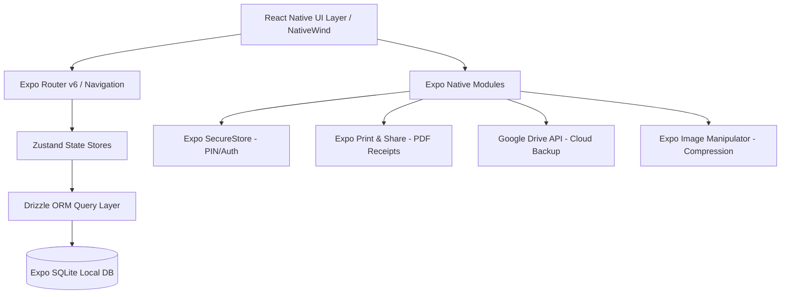

# 🏋️‍♂️ Star Gym — Offline-First Gym & Fitness Management Mobile App

> **A production-ready, local-first mobile management system built with React Native (Expo SDK 54), Drizzle ORM, SQLite, and NativeWind. Engineered for fitness centers to manage memberships, automate complex fee collections, generate branded PDF receipts, track profits/expenses, and backup data to Google Drive.**

---

## 📌 Project Overview

**Star Gym** is a high-performance, offline-first mobile application tailored for gym owners and fitness club managers. Unlike SaaS management software that requires expensive monthly subscriptions and constant internet connectivity, Star Gym operates **100% offline with zero latency**, storing data securely on the device using SQLite and offering seamless cloud backups to **Google Drive**.

- **Type:** Mobile Application (iOS & Android)
- **Role:** Full Stack Mobile Developer (Architecture, UI/UX, Database, Integrations)
- **Tech Stack:** React Native, Expo SDK 54, TypeScript, Drizzle ORM, Expo SQLite, NativeWind (TailwindCSS), Zustand, Expo Print, Google Drive API

---

## 📸 Portfolio Media & Screenshot Guide

To showcase this project effectively on your portfolio, GitHub, or LinkedIn, capture high-resolution screenshots with realistic data. Follow this curated asset guide:

### 📱 1. Core Screens to Capture (Recommended 8-10 Shots)

| # | Screen Name | Route / Path | What to Show / Focus On |
|---|-------------|--------------|--------------------------|
| **01** | **Executive Dashboard** | `app/(tabs)/index.tsx` | Summary KPI cards (Active Members, Due Today, Monthly Revenue, Pending Fees), Quick Action floating bar, and Recent Activities stream. |
| **02** | **Member Directory & Search** | `app/(tabs)/members.tsx` | Search bar with filter chips (`All`, `Active`, `Overdue`, `Frozen`). Show avatar photos, member code (`#GYM-001`), and color-coded status badges. |
| **03** | **Collect Fee & Smart Billing** | `app/collect-fee.tsx` | Partial/Advance payment selector, discount calculation (Flat / %), Credit balance application, and Change Return toggle. |
| **04** | **Branded PDF Receipt** | `app/receipt/[id].tsx` | Clean printed receipt modal with Gym Logo, Gym Name, Receipt #, Payment Method (Cash/JazzCash/EasyPaisa), Covered Period, and Share button. |
| **05** | **Financial & Profit/Loss Analytics** | `app/(tabs)/reports.tsx` | Revenue vs Expenses bar charts (`react-native-chart-kit`), Net Profit summary card, and category breakdown. |
| **06** | **Membership Profile & Freeze System** | `app/member/[id].tsx` & `freeze-member.tsx` | Member profile details, payment history timeline, active freeze dates, and automatic due-date extension notice. |
| **07** | **Expense Management** | `app/manage-categories.tsx` | Categorized gym operational costs (Rent, Electricity, Equipment, Trainer Salaries) with date filters. |
| **08** | **App Security (PIN / Biometric Lock)** | `features/security/` | Sleek dark-mode PIN keypad and biometric authentication prompt (Fingerprint / Face ID). |
| **09** | **Cloud Backup & Restore** | `features/backup/` | Google Drive sync status card, last synced timestamp, and one-tap manual backup/restore progress modal. |
| **10** | **Settings & Gym Branding** | `app/(tabs)/settings.tsx` | Customizable gym metadata (Logo, Name, Currency PKR, Default Fee, Receipt prefix & custom footer). |

---

### 🎨 Pro Presentation Tips for Portfolio:
1. **Use Device Mockups:** Place the captured screens into modern iPhone 16 / Pixel 9 3D frames using tools like [MockupBro](https://mockupbro.com), [Shots.so](https://shots.so), or Figma.
2. **Realistic Sample Data:** Populate the app with 5–8 realistic gym members with avatars, realistic PKR fee numbers (e.g. Rs. 3,500 / month), and 2-3 months of payment records.
3. **Hero Mockup Banner:** Create a 3-phone staggered hero image showcasing the **Dashboard**, **Collect Fee Screen**, and **Financial Chart**.

---

## 🚀 Key Features & Highlights

### 💰 1. Intelligent Billing & Credit Banking Engine
- **Flexible Payments:** Supports Full, Partial, and Multi-Month Advance payments.
- **Smart Credit Pool:** If a member pays extra, the owner can either **bank the excess as a credit balance** toward next month or **record cash change given**.
- **Accurate Discount Support:** Applies either flat currency discounts or percentage waivers with real-time recalculation.
- **Precision Integer Math:** All monetary figures are stored and processed in minor units (paisa) to completely eliminate floating-point arithmetic errors.

### 📄 2. Instant PDF Invoicing & WhatsApp Sharing
- Generates professional, branded thermal/A4 style PDF receipts on the fly using `expo-print`.
- Includes unique auto-incrementing receipt numbers (e.g., `GYM-2026-0042`), payment channel snapshots, and covered membership period.
- One-tap sharing via `expo-sharing` directly to WhatsApp, SMS, or AirPrint.

### ❄️ 3. Membership Freeze Engine
- Allows gym owners to pause memberships for sick leave or travel.
- Automatically calculates and extends the member's `due_date` by the exact frozen duration upon resumption without manual calculation mistakes.

### 📊 4. Revenue, Expense & Profit/Loss Visuals
- Detailed expense logging categorized under custom labels (Utilities, Rent, Supplements, Maintenance).
- Interactive monthly revenue vs expense breakdown charts powered by `react-native-chart-kit`.
- Clear calculation of gross income, total expenses, and net profit margins.

### ☁️ 5. Zero-Cost Cloud Backup & Recovery (Google Drive)
- Direct OAuth integration with Google Drive API.
- Backs up the SQLite database and all compressed member profile photos into an encrypted `.zip` bundle (`jszip`).
- Full automated restore pipeline allowing instant data recovery on new devices.

### 🔒 6. Biometric Security & Data Privacy
- Local PIN and Biometric (FaceID / Fingerprint) authentication via `expo-local-authentication` and `expo-secure-store`.
- Auto-lock timer when backgrounded for maximum business privacy.

### 🧹 7. Storage Optimization & Photo Purging
- Automatic client-side image compression on upload with `expo-image-manipulator`.
- Automated cleanup routine for archiving/purging photos of members inactive for 90+ days to minimize cloud storage consumption.

---

## 🛠️ Architecture & Tech Stack



| Layer | Technology | Purpose |
|---|---|---|
| **Framework** | **React Native (v0.81) / Expo SDK 54** | Cross-platform native mobile performance |
| **Routing** | **Expo Router v6** | Typed, file-based routing with tab and modal layouts |
| **Language** | **TypeScript (~5.9)** | Strict type-safety across database models, props, and financial calculations |
| **Database** | **Expo SQLite (~16.0)** | Embedded, ACID-compliant local relational database |
| **ORM** | **Drizzle ORM (~0.45)** | Type-safe schema definitions, relationships, and queries |
| **Styling** | **NativeWind (v4) / TailwindCSS** | Modern utility-first responsive UI with Dark Mode support |
| **State Management**| **Zustand (v5)** | Lightweight global state for themes, authentication state, and filters |
| **Forms & Validation**| **React Hook Form + Zod** | Form validation with strict validation schemas |
| **PDF & Printing** | **Expo Print & Expo Sharing** | Direct PDF receipt rendering and native share sheet |
| **Cloud Sync** | **Google Sign-In + JSZip + REST API** | Encrypted SQLite & photo archives backed up to user's Google Drive |
| **Security** | **Expo SecureStore & Local Authentication** | Hardware-backed biometric authentication and encrypted key storage |

---

## 🧠 Engineering Challenges & Solutions

### 1. Complex Gym Payment Workflows (Overpayments, Underpayments, Advance)
- **Challenge:** Gym members frequently pay odd amounts (e.g. paying 5,000 for a 3,500 fee, or paying 2 months upfront with partial discounts).
- **Solution:** Engineered a robust `feeCalculations.ts` state machine using integer minor-units arithmetic. It cleanly separates the payable fee, applied discount, banked credit balance, and change returned, preserving immutable financial snapshot records in the database.

### 2. True Offline-First Architecture with Cloud Peace-of-Mind
- **Challenge:** Gym owners often operate in basements or areas with poor cellular signal and don't want to pay recurring database server costs.
- **Solution:** Implemented a pure local SQLite architecture using Drizzle ORM for instant 0ms queries. Added a lightweight Google Drive sync engine that compresses the database and local photos into a ZIP archive, saving backups directly to the owner's personal Google Drive without any intermediary backend servers.

### 3. Immutable Financial Receipts
- **Challenge:** If a gym owner changes a member's fee or name in the future, past receipts must not change retroactively.
- **Solution:** Added snapshot fields (`memberNameAtPayment`, `feeAtPayment`, `discountAtPayment`) into the `payments` schema table, ensuring historic financial integrity and 100% audit accuracy.

---

## 📦 Directory Structure

```
GYM-Managment/
├── app/                      # Expo Router File-based Navigation
│   ├── (tabs)/               # Bottom Tabs (Dashboard, Members, Reports, Settings)
│   ├── member/               # Member details, edit, and history views
│   ├── receipt/              # PDF Receipt view and preview modals
│   ├── collect-fee.tsx       # Fee collection & payment handling
│   ├── freeze-member.tsx     # Member freeze/unfreeze management
│   └── _layout.tsx           # Global root navigation & security guards
├── components/               # Reusable UI Components (Cards, Badges, Modals, Inputs)
├── db/                       # Database layer
│   ├── schema.ts             # Drizzle ORM Schema (Members, Payments, Freezes, Expenses, etc.)
│   ├── queries.ts            # Type-safe database queries & transactional operations
│   └── client.ts             # Expo SQLite connection initialization
├── features/                 # Modular feature domains
│   ├── backup/               # Google Drive backup, zip bundling, and restore logic
│   ├── payments/             # Billing state calculations and receipt generators
│   ├── members/              # Member filtering, photo handling, and CRUD logic
│   ├── security/             # PIN screen, biometric verification, SecureStore
│   └── reports/              # Financial aggregation and chart data formatters
└── utils/                    # Utility helpers (Currency minor units, Date formatting, PDF Templates)
```

---

## 🏁 Summary for Portfolio Showcase

> *"Star Gym solves real-world gym management pain points by replacing complex paper registers and expensive SaaS tools with a slick, local-first mobile app. Featuring robust offline data persistence, automated billing math, dynamic membership freezes, and Google Drive cloud backups, it demonstrates high-level React Native architecture and production-grade engineering."*
