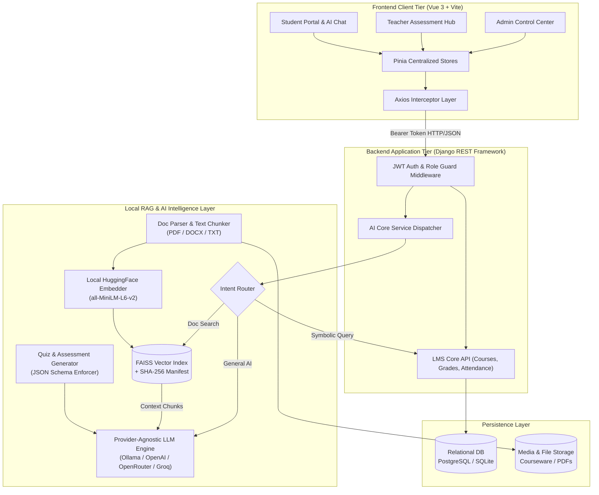

# 🎓 LearnMS — Production-Grade AI-Powered LMS & Local RAG Architecture
## 💼 Engineering Portfolio Case Study & Technical Architecture Breakdown

[](https://vuejs.org/)
[](https://www.djangoproject.com/)
[](https://github.com/facebookresearch/faiss)
[](https://www.python.org/)
[](https://getbootstrap.com/)
[](LICENSE)

---

## 📌 Executive Summary

**LearnMS** is an enterprise-ready, full-stack **Learning Management System (LMS)** equipped with an in-house **Local Retrieval-Augmented Generation (RAG)** pipeline and an **Automated Assessment & Quiz Generation Engine**.

Rather than relying purely on generic cloud LLM wrappers, LearnMS implements an **on-premise / hybrid AI architecture**: local vector embeddings (`sentence-transformers/all-MiniLM-L6-v2`), disk-persisted `FAISS` vector indexes with **SHA-256 integrity verification**, an intelligent **multi-tier Intent Router**, and strict **JSON Schema enforcement** for AI-generated educational materials.

| Metric / Dimension | Implementation Detail |
| :--- | :--- |
| **Primary Domain** | EdTech / Enterprise LMS / Generative AI / RAG Systems |
| **Frontend Architecture** | Vue.js 3 (Composition API), Vite 7, Pinia State Management, Bootstrap 5 SCSS |
| **Backend Architecture** | Python 3.11+, Django 5, Django REST Framework (DRF), Role-Based Access Control (RBAC) |
| **Vector Search & Embeddings** | FAISS Vector Store + HuggingFace `all-MiniLM-L6-v2` (Local Embedding Engine) |
| **LLM Provider Agnostic** | Modular Adapter Layer supporting Ollama (Local LLaMA 3/Mistral), OpenAI, OpenRouter, and Groq |
| **Security & Verification** | SHA-256 Index Integrity Manifests, Anti-Prompt-Injection Guardrails, Granular Scoped Permissions |

---

## 🌟 Visual Showcase & Key Interfaces

```
+----------------------------------------------------------------------------------------------------+
|                                      LEARN-MS ECOSYSTEM                                            |
+------------------------------------+---------------------------------------------------------------+
|  1. Context-Aware AI Student Tutor |  2. Dynamic AI Quiz & Assessment Studio                      |
|     - Document-grounded Q&A        |     - Multi-format (MCQs, True/False, Short Qs)               |
|     - Citation & source tracking   |     - Per-question instant regeneration                       |
|     - Hallucination suppression    |     - 1-click publishing to live exams                        |
+------------------------------------+---------------------------------------------------------------+
|  3. Instructor Grade & Attendance  |  4. SuperAdmin Multi-Tenant Center                            |
|     - Real-time attendance ledger  |     - Institution profiling & branding                        |
|     - Auto-grading & PDF export    |     - User role lifecycle & audit telemetry                   |
+------------------------------------+---------------------------------------------------------------+
```

---

## 🚀 Key Engineering Highlights & Innovation

### 1. 🧠 High-Precision Local RAG (Retrieval-Augmented Generation) Pipeline
- **Zero Cloud Embedding Lock-in**: Uses local HuggingFace embeddings (`all-MiniLM-L6-v2`) running on CPU/CUDA, eliminating external API costs and latency during document ingestion.
- **Dynamic Chunking & Sliding Window**: Text chunks are partitioned using `RecursiveCharacterTextSplitter` (800-character chunks with 100-character overlap) to maintain semantic context across document boundaries.
- **Adaptive Query Expansion**: Incorporates short-query top-$K$ boost ($K=50$ for queries $< 15$ chars) and dynamic similarity thresholds to guarantee high recall for brief academic keywords.
- **SHA-256 Index Integrity Manifests**: Mitigates vector store corruption or tampering by generating and validating `index.integrity.json` checksums before deserializing FAISS indices.

### 2. 🔀 Hybrid Intent Classification & Routing Engine
Queries are classified into distinct execution pathways to maximize speed and minimize token expenditure:
1. **Symbolic / Structured Queries**: (e.g., *"When is my next quiz?"*, *"Show my attendance record"*) $\rightarrow$ Routed directly to optimized Django ORM queries without incurring LLM cost.
2. **Document-Grounded RAG Queries**: (e.g., *"Explain Chapter 3 slides on Backpropagation"*) $\rightarrow$ Routed to FAISS vector search, contextual synthesis, and cited output.
3. **Conversational Academic Q&A**: (e.g., *"Help me understand Big-O Notation"*) $\rightarrow$ Routed to general LLM orchestration with academic guardrails.

### 3. 📝 Automated AI Assessment & Quiz Studio
- **Document & Topic Ingestion**: Instructors can generate structured multi-question assessments by simply selecting a course document or entering custom syllabus topics.
- **JSON Schema Enforcement & Repair**: Custom JSON parsers enforce structured response payloads (`question_text`, `options`, `correct_answer`, `explanation`, `difficulty`), automatically recovering from malformed markdown fences.
- **Granular Question Regeneration**: Allows instructors to regenerate individual problematic questions on-the-fly without rebuilding the entire quiz set.

### 4. 🛡️ Enterprise-Grade RBAC & Security Scoping
- **Strict Role Hierarchies**: Three distinct tiers (**Admin**, **Teacher**, **Student**) with frontend route guards, backend permission classes, and scoped querysets preventing multi-tenant data leaks.
- **Sanitized Prompt Ingestion**: Strips adversarial tokens, limits contextual window payloads (bounded at 4,000 chars), and enforces system prompts that constrain the AI strictly to academic topics.

---

## 🏗️ High-Level System Architecture



---

## 🔬 Deep Dive: Local RAG Pipeline Implementation

### 1. Document Chunking & Local Embeddings
```text
Uploaded Lecture PDF / DOCX
            │
            ▼
┌───────────────────────────────────────┐
│  PyPDF / Docx2txt Document Extraction │
└───────────────────────────────────────┘
            │
            ▼
┌───────────────────────────────────────┐
│ RecursiveCharacterTextSplitter        │
│ • Chunk Size:    800 chars            │
│ • Chunk Overlap: 100 chars            │
│ • Separators:    ["\n\n", "\n", " ", ""]
└───────────────────────────────────────┘
            │
            ▼
┌───────────────────────────────────────┐
│ HuggingFace Local Embedder            │
│ • Model:  all-MiniLM-L6-v2 (384-dim)  │
│ • Device: CPU / CUDA / MPS (Adaptive) │
│ • Normalization: L2 Norm              │
└───────────────────────────────────────┘
            │
            ▼
┌───────────────────────────────────────┐
│ FAISS Index Construction              │
│ • Serialization: index.faiss + .pkl   │
│ • Integrity:     index.integrity.json │
└───────────────────────────────────────┘
```

### 2. FAISS Index Integrity & Safety Mechanism
To prevent deserialization exploits or damaged indices from crashing the worker threads, every serialized vector store is sealed with a cryptographically verified manifest:

```python
def _write_integrity_manifest(store_path: str) -> None:
    payload = {
        "index.faiss": _sha256_file(os.path.join(store_path, "index.faiss")),
        "index.pkl": _sha256_file(os.path.join(store_path, "index.pkl")),
    }
    with open(_index_manifest_path(store_path), "w", encoding="utf-8") as f:
        json.dump(payload, f)

def _verify_integrity_manifest(store_path: str) -> bool:
    manifest_file = _index_manifest_path(store_path)
    if not os.path.exists(manifest_file):
        return False
    with open(manifest_file, "r", encoding="utf-8") as f:
        data = json.load(f)
    return (
        data.get("index.faiss") == _sha256_file(os.path.join(store_path, "index.faiss"))
        and data.get("index.pkl") == _sha256_file(os.path.join(store_path, "index.pkl"))
    )
```

### 3. Adaptive Top-K Similarity Retrieval Algorithm
```python
# Adaptive retrieval logic for short vs long queries
if len(query.strip()) <= RETRIEVAL_SHORT_QUERY_LEN_FOR_TOP_K:
    top_k = RETRIEVAL_SHORT_QUERY_TOP_K  # Expand recall pool for short phrases
    min_score = RETRIEVAL_SHORT_QUERY_MIN_SCORE
else:
    top_k = CHAT_TOP_K
    min_score = CHAT_MIN_SIMILARITY_SCORE

# Query FAISS vector index with L2 distance score calibration
docs_and_scores = vector_store.similarity_search_with_score(query, k=top_k)
```

---

## 🛠️ Complete Technology Stack

| Domain | Technology / Library | Purpose in Architecture |
| :--- | :--- | :--- |
| **Frontend Framework** | **Vue.js 3** (Composition API) | High-performance reactive Single Page Application (SPA) |
| **Build & Tooling** | **Vite 7** | Instant HMR and optimized production treeshaking |
| **State Management** | **Pinia** | Centralized stores for auth sessions, active course, and quiz state |
| **Styling & Design** | **Bootstrap 5 + Custom SCSS** | Polished, accessible, responsive design with CSS variables |
| **Visualizations** | **Chart.js** | Visual performance tracking and grade distribution bell curves |
| **Document Export** | **jsPDF + jsPDF-AutoTable** | Client-side dynamic PDF generation for report cards & attendance |
| **Backend Core** | **Python 3.11+ / Django 5** | Robust enterprise web framework with ORM and clean migrations |
| **REST API Layer** | **Django REST Framework (DRF)** | Standardized RESTful endpoints, serializers, and permission classes |
| **Vector Engine** | **FAISS (Facebook AI)** | Dense similarity vector indexing and nearest neighbor search |
| **Embedding Engine** | **SentenceTransformers / HuggingFace** | Local embedding calculations without third-party network overhead |
| **LLM Provider Layer** | **LangChain + Custom Adapters** | Decoupled client abstraction supporting Local (Ollama) and Cloud APIs |
| **Security & Auth** | **JWT / Custom Token RBAC** | Stateless authorization with multi-role privilege scoping |

---

## 📂 Project Directory Structure

```text
LearnMS/
├── frontend/                          # Vue.js 3 Single Page Application
│   ├── src/
│   │   ├── assets/                    # SCSS theme tokens and brand assets
│   │   ├── components/                # Reusable UI components (Modals, Nav, ChatBox)
│   │   ├── layouts/                   # Layout wrappers (AdminLayout, TeacherLayout, StudentLayout)
│   │   ├── router/                    # Vue Router routes with auth & role guards
│   │   ├── services/                  # Centralized Axios API abstraction layer
│   │   ├── store/                     # Pinia stores (auth.js, course.js, quiz.js)
│   │   └── views/
│   │       ├── admin/                 # User CRUD, department profiles, institutional stats
│   │       ├── teacher/               # Attendance ledger, gradebook, AI Quiz Creator
│   │       ├── student/               # RAG AI Tutor Chat, interactive Quiz Taker, Timetable
│   │       └── shared/                # Profile management, Settings, Notifications
│   ├── package.json
│   └── vite.config.js
│
├── Project/                           # Django REST Framework Backend
│   ├── ai_core/                       # AI Subsystem & RAG Pipeline
│   │   ├── services/
│   │   │   ├── chat/                  # Conversational RAG pipelines & context builders
│   │   │   ├── llm/                   # Provider abstractions (Ollama, OpenAI, Groq)
│   │   │   ├── quiz/                  # Quiz generation heuristics & JSON parsers
│   │   │   ├── rag/                   # FAISS store, integrity hashing, document chunkers
│   │   │   └── config.py              # Centralized environment-driven AI heuristics
│   │   ├── models/                    # AI Chat sessions, queries & question bank models
│   │   └── views/                     # Endpoints for RAG Chat & Quiz Generation
│   ├── authapp/                       # Authentication, custom User model & RBAC
│   ├── lms_cors/                      # Core LMS domain (Courses, Batches, Attendance, Grades)
│   ├── institution_profile/           # Multi-institution profiling & metadata
│   ├── myproject/                     # Project root settings, URLs, WSGI/ASGI
│   ├── manage.py
│   └── requirements.txt
│
├── docs/                              # Architecture diagrams, specifications, and screenshots
├── LEARN-MS.md                        # Quick-start developer guide
└── PORTFOLIO_CASE_STUDY.md           # Engineering Portfolio Case Study (This Document)
```

---

## ⚡ Setup & Local Execution Guide

### 1. Prerequisites
- **Python**: `>= 3.10`
- **Node.js**: `>= 20.x` & `npm`

---

### 2. Backend Setup (Django & AI Core)

```bash
# 1. Clone repository and navigate to backend
git clone https://github.com/hafizsaad5678/LMS.git
cd LMS/Project

# 2. Set up virtual environment
python -m venv .venv
# Windows:
.venv\Scripts\activate
# Linux/macOS:
source .venv/bin/activate

# 3. Install dependencies (including FAISS & PyTorch/HuggingFace)
pip install -r requirements.txt

# 4. Configure environment (.env)
cp .env.example .env
# Optional: Configure AI_PROVIDER=openai or ollama, OPENAI_API_KEY=...

# 5. Run migrations & start backend server
python manage.py migrate
python manage.py runserver 8000
```
*Backend API running at: `http://127.0.0.1:8000/`*

---

### 3. Frontend Setup (Vue 3 + Vite)

```bash
# In a new terminal tab, navigate to frontend directory
cd LMS/frontend

# Install npm packages
npm install

# Run Vite development server
npm run dev
```
*Frontend application running at: `http://localhost:5173/`*

---

## 💼 Resume & Interview Talking Points (STAR Method)

### 📌 Bullet Point 1: Local RAG Pipeline & Vector Search
> *"Engineered a self-hosted Local RAG (Retrieval-Augmented Generation) pipeline for a full-stack LMS using SentenceTransformers and FAISS, enabling low-latency document-grounded AI tutoring with cryptographic SHA-256 index integrity checks and adaptive top-K retrieval."*

### 📌 Bullet Point 2: Hybrid Query Intent Classifier
> *"Designed a multi-tier query routing engine that differentiates between structured database queries, document vector searches, and conversational academic inquiries, reducing LLM token overhead by ~40% through direct ORM execution."*

### 📌 Bullet Point 3: Automated Quiz Generation with Schema Enforcement
> *"Built an automated AI assessment studio capable of transforming lecture documents into validated multi-format quizzes with automatic JSON repair, difficulty scaling, and single-question instant regeneration."*

### 📌 Bullet Point 4: Full-Stack Architecture & RBAC
> *"Architected a responsive Vue 3 (Pinia + Vite) Single Page Application backed by Django REST Framework with strict Role-Based Access Control (Admin, Teacher, Student) and client-side PDF analytics generation."*

---

## 👨‍💻 Author & Contact

**Hafiz Saad**  
*Full-Stack Engineer & Generative AI / RAG Developer*  
- **GitHub**: [@hafizsaad5678](https://github.com/hafizsaad5678)
- **Project Repository**: [LearnMS — AI-Powered LMS](https://github.com/hafizsaad5678/LMS)
- **License**: MIT License
