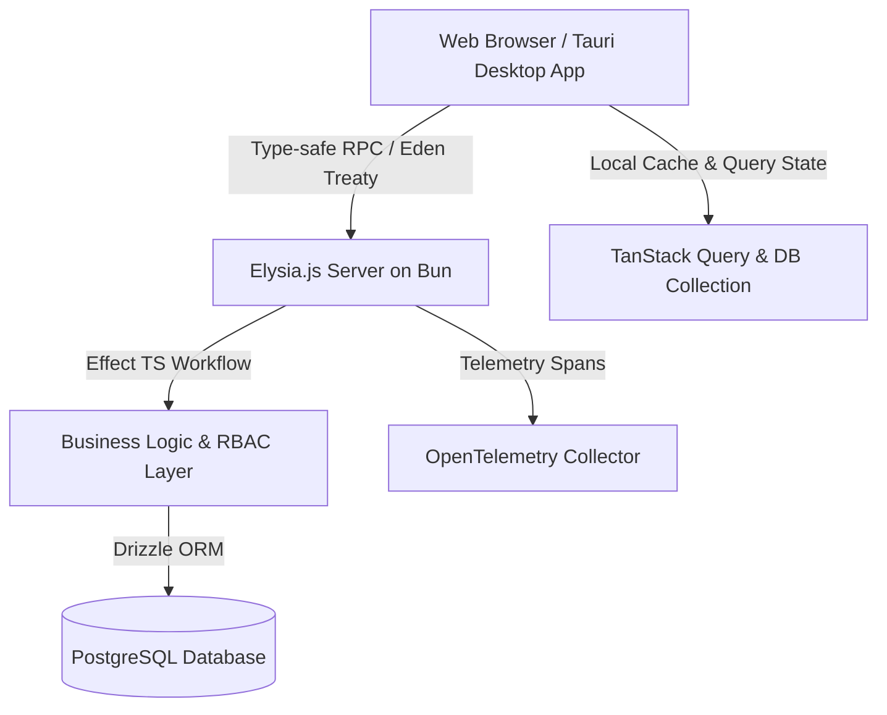

# 🍽️ <!-- [Your Project / Brand Name] e.g. Royal Grills --> Enterprise Restaurant POS & Management System

> **A high-performance, real-time POS (Point of Sale) and restaurant management ecosystem** built as a cross-platform solution (Web & Desktop) with cutting-edge modern technologies.

---

## 📌 Project Overview

<!-- Project Brand Name: [Your Project Name] -->
This project is a comprehensive, full-stack Point of Sale (POS) and Restaurant Management solution designed for high-traffic food businesses and restaurants. Built from the ground up for speed, offline reliability, and rich user experience, it unifies front-of-house order management, kitchen workflows, inventory tracking, customer analytics, and enterprise data backups into a single streamlined application.

- **Type:** Full-Stack Web App & Native Desktop Application (Cross-Platform)
- **Architecture:** Monorepo (Bun Workspaces) with End-to-End Type-Safe Architecture
- **Target Platforms:** Web, Windows, macOS, Linux (via Tauri 2.0)

---

## ✨ Key Features & Modules

### ⚡ 1. High-Speed Point of Sale (POS)
- Ultra-responsive, touch-friendly POS interface designed for rapid order processing.
- Dynamic cart calculations with tax, discounts, custom item modifiers, and combo deals.
- Instant receipt formatting and split-bill / quick-pay options.

### 📋 2. Order & Kitchen Management
- Real-time order lifecycle tracking: `Draft` ➔ `Pending` ➔ `In Kitchen` ➔ `Served` ➔ `Completed` / `Cancelled`.
- Table management with live visual occupancy states.
- Multi-channel support (Dine-in, Takeaway, Delivery).

### 📦 3. Menu, Inventory & Catalog Engine
- Hierarchical categories, sub-categories, variation matrices, and add-on groups.
- Real-time stock alerts and ingredient usage tracking.
- Bulk price updates and fast barcode/SKU search.

### 👥 4. Customer CRM & Loyalty
- Customer order history, visit analytics, and spending summaries.
- Fast checkout customer search & auto-fill.

### 🛡️ 5. Role-Based Access Control (RBAC) & Security
- Granular permissions for Cashiers, Waiters, Kitchen Staff, Store Managers, and Admins.
- Secure session tokens, audited operations, and PIN-based quick switch.

### 💾 6. Automated Backup & Disaster Recovery
- Background database snapshotting and automated PostgreSQL backup sidecars.
- One-click restore system designed for on-premise resilience.

### 📊 7. Analytics & Observability
- Interactive revenue graphs, peak-hour heatmaps, and best-selling item metrics via Recharts.
- Enterprise-grade OpenTelemetry tracing and metrics for tracking server performance and latency bottlenecks.

---

## 🛠️ Technology Stack & Architecture

### **Frontend & Desktop Layer**
| Technology | Role / Purpose |
|---|---|
| **React 19** | Core UI library utilizing modern compiler optimizations & transitions |
| **Vite 7** | Next-gen blazing fast development and build pipeline |
| **Tauri 2.x** | Ultra-lightweight native desktop shell with native Rust bridge |
| **TanStack Suite** | Router (file-based), Query (caching), Table (datagrids), Form (forms) |
| **Tailwind CSS v4** | Modern token-based CSS engine with dark/light themes |
| **shadcn/ui & Radix UI** | Accessible, headless UI component foundations |
| **Motion & GSAP** | Fluid micro-interactions and smooth POS feedback animations |
| **Zustand** | Lightweight global state management for POS carts & themes |
| **Paraglide JS** | Ultra-fast compile-time internationalization (i18n) |

### **Backend & Database Layer**
| Technology | Role / Purpose |
|---|---|
| **Bun Runtime** | High-performance JavaScript/TypeScript execution runtime |
| **Elysia.js** | Ultra-fast web framework optimized for Bun with OpenAPI integration |
| **Effect-TS** | Functional programming paradigm for robust error handling & transactions |
| **Drizzle ORM** | Type-safe SQL query builder and schema management |
| **PostgreSQL** | Relational database handling transactions, orders, and audits |
| **Eden Treaty** | End-to-end compile-time type safety between Client and Server APIs |
| **OpenTelemetry** | Distributed tracing, performance spans, and diagnostic metrics |

---

## 🏛️ System Architecture



---

## 💡 Engineering Highlights & Challenges Solved

1. **End-to-End Type Safety:** Leveraged **Eden Treaty** with Elysia to make frontend and backend contract sharing 100% type-safe without generating manual SDKs.
2. **Resilient Error Handling with Effect-TS:** Eliminated unhandled exceptions and unhandled DB drops by structuring all backend services using **Effect-TS** functional error channels and monadic transactions.
3. **Hybrid Web & Desktop Architecture:** Built a single unified codebase that runs as a web dashboard and compiles down to a lightweight 15MB **Tauri** desktop binary with local backup sidecars.
4. **Sub-second Checkout Speeds:** Optimized client-side state with TanStack Table and local state indexing, handling catalogs of thousands of products with zero rendering lag.

---

## 📸 Screenshots & Showcase

> *Tip: Add your live screenshots or demo GIFs below for your portfolio showcase.*

| POS Terminal View | Analytics Dashboard |
| :---: | :---: |
| *(Add POS Screenshot here)* | *(Add Analytics Screenshot here)* |

| Menu & Inventory Manager | Order Management Board |
| :---: | :---: |
| *(Add Menu Screenshot here)* | *(Add Orders Screenshot here)* |

---

## 🚀 Getting Started (Local Development)

### Prerequisites
- [Bun](https://bun.com) (v1.2+)
- [PostgreSQL](https://www.postgresql.org/) (v15+)

### Installation & Run

```bash
# Clone the repository
git clone https://github.com/your-username/restaurant-pos.git
cd restaurant-pos

# Install dependencies
bun install

# Setup database & migrations
bun run db:p
bun run db:seed

# Start Frontend and Backend concurrently
bun run dev:c   # Starts Frontend on http://localhost:3000
bun run dev:s   # Starts Backend on http://localhost:4000
```

---

## 👨‍💻 Developed By

- **Project Lead / Full-Stack Developer:** [Your Name]
- **Portfolio / Website:** [yourportfolio.com](https://yourportfolio.com)
- **LinkedIn:** [linkedin.com/in/yourprofile](https://linkedin.com/in/yourprofile)
- **GitHub:** [@yourusername](https://github.com/yourusername)
