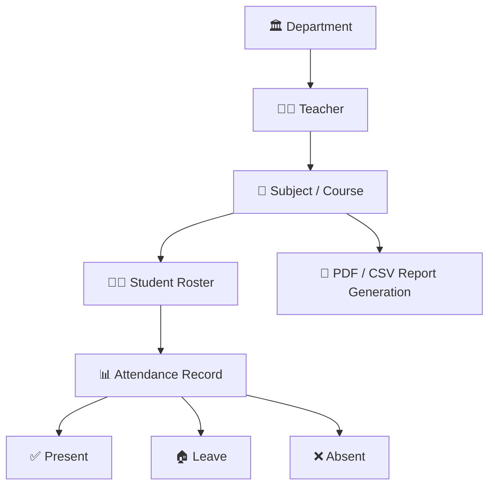
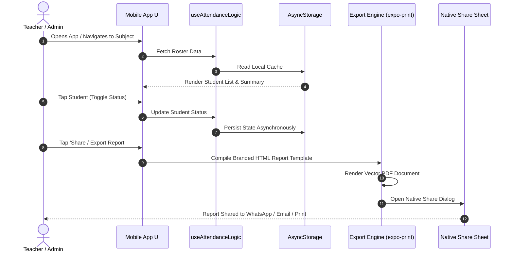

# 📱 Smart Attendance (Smart A) — Mobile Attendance & Academic Management System

<div align="center">


**A high-performance, cross-platform mobile attendance tracking and institutional hierarchy management system built for schools, colleges, and universities.**

[Live Demo](#-key-features) • [Architecture](#-system-architecture) • [Technical Stack](#-technology-stack) • [Export Engine](#-automated-report-generation-pdf--csv) • [Setup](#-installation--getting-started)

</div>

---

## 📌 Project Overview

**Smart Attendance (Smart A)** solves the friction and inaccuracies of manual paper-based attendance management in educational institutions. Developed with **React Native**, **Expo SDK 54**, and **TypeScript**, the application delivers a complete end-to-end workflow: from organizing institutional hierarchies (Departments ➔ Teachers ➔ Subjects ➔ Students) to 1-tap real-time attendance marking and 1-click generation of certified, printable PDF & CSV reports.

### 🎯 Key Problems Solved
- **Eliminates Paper Workflows:** Saves instructor lecture time with intuitive, one-touch multi-state attendance logging.
- **Hierarchical Institutional Organization:** Reflects true academic structure by nesting teachers and subjects under respective departments.
- **Instant Official Documentation:** Automatically embeds institutional branding, attendance ratios, and signature verification sections into downloadable and shareable PDF documents.
- **100% Offline Capability:** Operates reliably in lecture halls and remote campuses with local asynchronous storage caching.

---

## 🌟 Key Features

### 🏢 1. Multi-Level Academic Hierarchy
- **Department Management:** Create, list, search, and manage individual departments.
- **Teacher Assignment:** Map teachers directly to their designated academic departments.
- **Course / Subject Mapping:** Assign classes and specific subjects to teachers.
- **Student Roster Management:** Maintain comprehensive student rosters per subject with quick add/delete modal workflows.

### ⚡ 2. 1-Tap Attendance Marking
- **Three-State Attendance Cycle:** Toggle between `Present` (✅), `Leave` (🏠), and `Absent` (❌) with single touches.
- **Live Roster Counters:** Instant calculation of present, leave, absent counts, and attendance percentage.
- **Visual Feedback:** Color-coded badges and haptic-ready UI elements for rapid input during class.

### 📄 3. Certified PDF & CSV Report Generator
- **Branded Institutional Reports:** Compiles HTML/CSS templates on-the-fly with college crests, date/time stamps, summary boxes, and principal verification lines.
- **Native PDF Rendering:** Utilizes `expo-print` for crisp, vector-grade document synthesis.
- **Cross-Platform Sharing:** Direct integration with `expo-sharing` to share reports via WhatsApp, Email, AirDrop, Google Drive, and local printer queues.
- **Structured CSV Export:** Generates clean comma-separated tabular data for administrative spreadsheet analysis.

### 📊 4. Executive Analytics Dashboard
- **Metric Cards:** Real-time visibility into target metrics, student numbers, and activity rates.
- **Progress Bars:** Visual indicators for weekly attendance milestones and department conversion benchmarks.
- **Activity Streams:** Real-time chronological log of recent administrative events.
- **Sleek Dark Theme:** Premium aesthetic with luminous glow effects, glassmorphic cards, and custom typography.

### 🔄 5. Fluid Navigation & Gestures
- **Gesture-Driven UX:** Swipe gestures enabled via `react-native-gesture-handler` for intuitive screen dismissals.
- **Hardware Back Button Handling:** Integrated Android hardware back key support with confirmation alerts at the root screen.

---

## 🛠 Technology Stack

| Category | Technology | Description |
| :--- | :--- | :--- |
| **Framework** | **React Native 0.81.5** / **Expo 54** | Cross-platform runtime targeting Android, iOS, and Web |
| **Language** | **TypeScript 5.9** / **React 19** | Strict type safety, clean component interfaces, and modern React hooks |
| **State Management** | **Custom Hook Architecture** | Decoupled business logic via `useAttendanceLogic` |
| **Storage & Persistence** | **AsyncStorage** | Resilient offline-first local data storage engine |
| **Document Synthesis** | **Expo Print & Expo Sharing** | Automated dynamic HTML-to-PDF engine and native share sheet |
| **Animations & Gestures** | **Reanimated 4** & **Gesture Handler** | 60 FPS fluid transitions and natural touch interactions |
| **Styling & UI** | **Custom Design System & Vector Icons** | Curated color palette, responsive cards, and FontAwesome5 / Ionicons / MaterialCommunityIcons |

---

## 🏗 System Architecture & Data Flow

### 🗂 Data Hierarchy Model



### 🔁 Application Workflow



---

## 📑 Automated Report Generation (PDF & CSV)

The export engine (`exportUtils.ts`) dynamically generates official institutional documents with the following structure:

```
+-------------------------------------------------------------+
|  [🏫 COLLEGE CREST]   GOVERNMENT GRADUATE COLLEGE           |
|                       OFFICIAL ATTENDANCE REPORT            |
+-------------------------------------------------------------+
| Department: Computer Science       Date: 2026-09-10         |
| Teacher: Prof. Ahmed               Time: 10:30 AM           |
| Subject: Data Structures & Algos                            |
+-------------------------------------------------------------+
| 📊 ATTENDANCE SUMMARY                                       |
| Present: 42  |  Leave: 3  |  Absent: 5  |  Rate: 84.0%      |
+-------------------------------------------------------------+
| 📋 STUDENT ROSTER & STATUS                                  |
| 1. Ali Khan           [✅ Present]                          |
| 2. Bilal Ahmed        [🏠 Leave]                            |
| 3. Hamza Tariq        [❌ Absent]                           |
| ...                                                         |
+-------------------------------------------------------------+
| Certified By: Principal                                     |
| Report ID: 1725964800000 | Verified via Smart Attendance    |
+-------------------------------------------------------------+
```

---

## 📂 Project Structure

```
Smart Attendance/
├── Attendance/
│   ├── app/                      # Expo Router / Application Entry
│   │   └── index.ts
│   ├── assets/                   # Institutional assets, icons, college logo
│   │   ├── collegeLogo.jpg
│   │   └── ...
│   ├── src/
│   │   ├── components/           # Modular UI Components
│   │   │   ├── DepartmentCard.tsx
│   │   │   ├── Header.tsx
│   │   │   ├── ModalComponent.tsx
│   │   │   ├── StudentItem.tsx
│   │   │   ├── SubjectItem.tsx
│   │   │   └── TeacherCard.tsx
│   │   ├── constants/            # Design tokens & color constants
│   │   │   └── colors.ts
│   │   ├── hooks/                # Custom React Business Logic Hooks
│   │   │   └── useAttendanceLogic.ts
│   │   ├── screens/              # Core Application Screens
│   │   │   ├── Dashboard/
│   │   │   │   └── Dashboard.tsx # Executive Analytics & Overview
│   │   │   ├── HomeScreen.tsx    # Welcome & Quick Action Hub
│   │   │   ├── DepartmentsScreen.tsx
│   │   │   ├── DepartmentScreen.tsx
│   │   │   ├── TeacherScreen.tsx
│   │   │   └── SubjectScreen.tsx # Student Roster & Attendance Marking
│   │   ├── styles/               # Reusable Global Stylesheets
│   │   │   └── globalStyles.ts
│   │   ├── types/                # TypeScript Interfaces & Model Types
│   │   │   └── index.ts
│   │   └── utils/                # Utilities & Document Engines
│   │       ├── exportUtils.ts    # PDF/CSV Generation & Native Sharing
│   │       └── storageUtils.ts   # AsyncStorage Persistence Engine
│   ├── app.json                  # Expo Configuration Manifest
│   ├── package.json              # Project Dependencies & Scripts
│   └── tsconfig.json             # TypeScript Configuration
└── PORTFOLIO.md                  # Project Case Study & Showcase
```

---

## 💻 Code Highlights

### 1. Robust Custom Business Logic Hook (`useAttendanceLogic.ts`)
Decouples UI rendering from data persistence, providing single-source-of-truth reactivity:

```typescript
export const useAttendanceLogic = () => {
  const [departments, setDepartments] = useState<Department[]>([]);
  const [selectedDept, setSelectedDept] = useState<Department | null>(null);
  const [selectedTeacher, setSelectedTeacher] = useState<Teacher | null>(null);
  const [selectedSubject, setSelectedSubject] = useState<Subject | null>(null);

  // Initialize and load persisted local data
  useEffect(() => {
    let mounted = true;
    (async () => {
      await storageUtils.init();
      if (!mounted) return;
      setDepartments([...storageUtils.getAllDepartments()]);
    })();
    return () => { mounted = false; };
  }, []);

  const handleToggleSubjectAttendance = async (
    deptId: string,
    teacherId: string,
    subjectId: string,
    studentId: string
  ): Promise<void> => {
    await storageUtils.toggleSubjectAttendance(deptId, teacherId, subjectId, studentId);
    refreshData();
  };

  return { departments, selectedDept, selectedTeacher, selectedSubject, handleToggleSubjectAttendance, ... };
};
```

### 2. Native PDF Document Rendering & Multi-Platform Sharing
```typescript
const { uri } = await Print.printToFileAsync({ html, base64: false });

await Sharing.shareAsync(uri, {
  mimeType: 'application/pdf',
  dialogTitle: 'Share Attendance Report',
  UTI: 'com.adobe.pdf',
});
```

---

## 🚀 Installation & Getting Started

### Prerequisites
- [Node.js](https://nodejs.org/) (v18 or higher recommended)
- [Expo Go](https://expo.dev/go) app on your mobile device (or Android Studio / Xcode simulator)

### Step-by-Step Setup

1. **Clone the repository:**
   ```bash
   git clone https://github.com/your-username/smart-attendance.git
   cd "Smart Attendance/Attendance"
   ```

2. **Install dependencies:**
   ```bash
   npm install
   ```

3. **Start the development server:**
   ```bash
   npx expo start
   ```

4. **Run on your target platform:**
   - Press <kbd>a</kbd> for **Android emulator** / scan QR with Expo Go.
   - Press <kbd>i</kbd> for **iOS simulator** / scan QR with Camera.
   - Press <kbd>w</kbd> for **Web browser**.

---

## 💡 Key Engineering Takeaways & Portfolio Highlights

- **Full Lifecycle React Native Architecture:** Designed and implemented a modular mobile app from foundational state management to polished production-grade UI.
- **Offline Data Resiliency:** Engineered local asynchronous storage logic capable of self-healing and deeply nested state updates without backend dependencies.
- **Document & Asset Compilation:** Built dynamic HTML-to-PDF rendering pipelines with embedded institutional assets and cross-platform native sharing.
- **High-Standard Code Quality:** Built with 100% strict TypeScript typing, modular folder separation, and responsive gesture-based UX.

---

<div align="center">

**Developed with ❤️ for Modern Educational Institutions**

</div>
